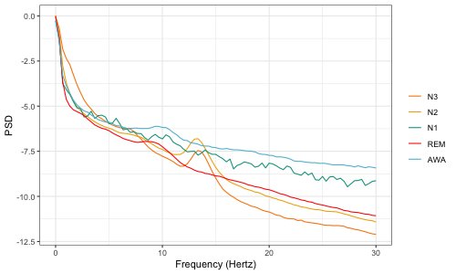

<!-- README.md is generated from README.Rmd. Please edit that file -->

```{r, echo = FALSE}
knitr::opts_chunk$set(
  collapse = TRUE,
  comment = "#>",
  fig.path = "man/figures/README-"
)
```

[](https://cran.r-project.org/package=rsleep) [](https://cran.r-project.org/package=rsleep) [](https://travis-ci.org/boupetch/rsleep)  [](https://cloud.docker.com/repository/docker/boupetch/rsleep/)
[](https://codecov.io/gh/boupetch/rsleep) [](https://opensource.org/licenses/MIT) 

rsleep is a R package providing tools for sleep data management, visualization and analysis. 

## Installation

Stable version can be downloaded and installed from [CRAN](https://cran.r-project.org/) @hornik2012comprehensive :

```{r install_cran, results="hide"}
install.packages("rsleep", repos = "https://cloud.r-project.org")
```

Development version can be directly installed from [Github](https://github.com/) using the `devtools` package :

```{r install_github, results="hide", message=FALSE}
devtools::install_github("boupetch/rsleep")
```

## Usage

```{r library,results="hide"}
library(rsleep)
```

## Vignettes

  * [Managing Sleep Records Files](http://htmlpreview.github.io/?https://raw.githubusercontent.com/boupetch/rsleep/master/doc/Managing_Sleep_Records_Files.html)
  * [Spectral analysis of sleep electroencephalography signals](http://htmlpreview.github.io/?https://raw.githubusercontent.com/boupetch/rsleep/master/doc/Spectral_analysis_sleep_electroencephalography.html)
  * [Automatic Stages Classification](http://htmlpreview.github.io/?https://raw.githubusercontent.com/boupetch/rsleep/master/doc/Automatic_Stage_Classification.html)
  
## Examples

```{r examples, include=FALSE}

if(!file.exists("vignettes/15012016HD.csv")){
  download.file("https://osf.io/h4ysj/download", "vignettes/15012016HD.csv")
}

if(!file.exists("vignettes/15012016HD.edf")){
  download.file("https://osf.io/57j2u/download", "vignettes/15012016HD.edf")
}


# Hypnogram
hypnogram <- rsleep::read_events_noxturnal("vignettes/15012016HD.csv")
png(filename="man/figures/README-example_hypnogram-1.png",width = 500, height = 200)
rsleep::plot_hypnogram(hypnogram)
dev.off()

# Hypnodensity
hypnodensity <- score_psg("vignettes/15012016HD.edf")
png(filename="man/figures/README-example_hypnodensity-1.png",width = 500, height = 200)
rsleep::plot_hypnodensity(hypnodensity)
dev.off()

# Spectral profiles
h <- edfReader::readEdfHeader("vignettes/15012016HD.edf")
s <- edfReader::readEdfSignals(h, signals = "C3-M2")
hypnogram <- head(hypnogram(hypnogram),-2)
startTime <- as.numeric(as.POSIXct(s$startTime))
epochs <- rsleep::epochs(s$signal,s$sRate,
                         epoch = hypnogram,
                         startTime = startTime)
periodograms <- mapply(x = epochs, y = hypnogram$event, FUN = function(x,y){
  p <- pwelch(x, sRate = s$sRate, show = FALSE)
  p <- as.data.frame(p[p$hz <= 30,])
  p$stage <- y
  p
}, SIMPLIFY = F)
periodograms_df <- do.call("rbind", periodograms)
avg_periodograms <- aggregate(psd ~ hz+stage, periodograms_df, mean)
library(ggplot2)
palette <- c("#F98400","#F2AD00","#00A08A","#FF0000","#5BBCD6")
png(filename="man/figures/README-example_spectral-profiles-1.png",width = 500, height = 300)
ggplot(avg_periodograms, aes(x=hz,y=psd,color=stage)) +
  geom_line() + theme_bw() +
  theme(legend.title = element_blank()) + 
  scale_colour_manual(name = "stage",
                      values = palette) +
  xlab("Frequency (Hertz)") + ylab("PSD")
dev.off()
```

[](http://htmlpreview.github.io/?https://raw.githubusercontent.com/boupetch/rsleep/master/doc/Managing_Sleep_Records_Files.html)

[](http://htmlpreview.github.io/?https://raw.githubusercontent.com/boupetch/rsleep/master/doc/Automatic_Stage_Classification.html)

[](http://htmlpreview.github.io/?https://raw.githubusercontent.com/boupetch/rsleep/master/doc/Spectral_analysis_sleep_electroencephalography.html)

## Docker

The rsleep package can be used through Docker, with the automatic build from [Dockerhub](https://cloud.docker.com/repository/docker/boupetch/rsleep/) or by building the image using the provided [Dockerfile](https://github.com/boupetch/rsleep/blob/master/Dockerfile).

### Example

Automatic sleep stages scoring using rsleep Docker image:

```
wget -O 15012016HD.edf https://osf.io/57j2u/download 

docker run --rm  -v $(pwd):/shared boupetch/rsleep R -e "write.csv(rsleep::score_psg('/shared/15012016HD.edf'),'/shared/hypnodensity.csv')"
```
  
## References
