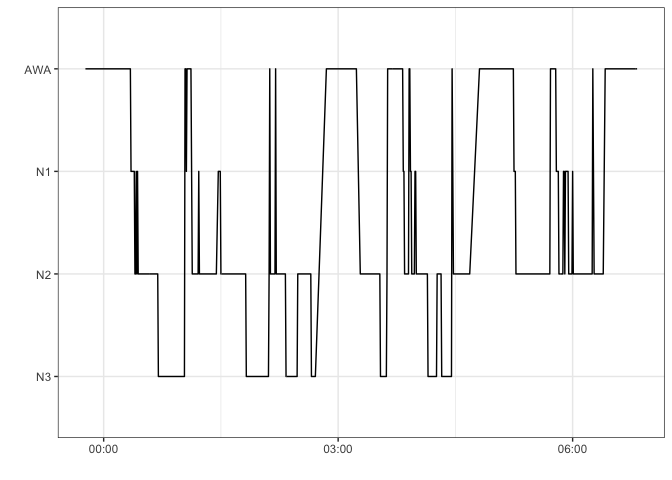

rsleep: A R package for sleep data analysis
================

## Installation

`rsleep` development version can be directly installed from Github using
the `devtools` package.

    devtools::install_github("boupetch/rsleep")

Otherwise stable version can be downloaded and installed from CRAN \[1\]
:

    install.packages("rsleep")

## Usage

Load the package using the `library()` function.

``` r
library(rsleep)
```

### File manipulation

In `rsleep`, `write_mdf()` and `read_mdf()` functions are used to write
and read records on disk. Files are converted from the European Data
Format \[2\] (EDF) to Morpheo Data Format \[3\] (MDF). MDF is a simple,
efficient and interoperable hierarchical file format for biological
timeseries. The format supports raw signal and metadata storage. MDF
uses binary files for signals and JSON for metadata.

### Sleep scoring

#### Stages

``` r
plot_hypnogram(example_hypnogram_30s)
```

<!-- -->

#### Electrocardiogram

`detect_rpeaks` implements the first part of the Pan & Tompkins
algorithm \[4\] to detect R peaks from an electrocardiogram (ECG)
signal.

``` r
library(ggplot2)

sRate <- 200

ecg <- data.frame(Volts = example_ecg_200hz,
                  Seconds = c(1:length(example_ecg_200hz))/sRate)

rpeaks <- detect_rpeaks(example_ecg_200hz, sRate)

ggplot(ecg,
       aes(x = Seconds,
           y = Volts)) +
  geom_line() +
  geom_vline(data.frame(p = rpeaks),
             mapping = aes(xintercept = p),
             linetype="dashed",color = "red")
```

<!-- -->

### Statistics computing

#### Stages & scoring

`stages_stats` function computes various statistics from the hypnogram.

  - `rem_duration`: Total duration of REM sleep in minutes.
  - `n1_duration`: Total duration of N1 sleep in minutes.
  - `n2_duration`: Total duration of N2 sleep in minutes.
  - `n3_duration`: Total duration of N3 sleep in minutes.
  - `awa_duration`: Total duration of wake in minutes.
  - `tts`: Time To Sleep (N1+N2+N3+REM durations) in minutes.
  - `rem_tts`: REM over TTS duration ratio.
  - `n3_tts`: N3 over TTS duration ratio.
  - `n2_tts`: N2 over TTS duration ratio.
  - `n1_tts`: N1 over TTS duration ratio.
  - `tsp`: Total Sleep Period.
  - `sleep_efficiency`: Sleep Efficiency.
  - `sleep_latency`: Sleep Latency.
  - `rem_latency`: REM Sleep Latency.
  - `waso`: Wake After Sleep Onset.

<!-- end list -->

``` r
stages_stats(example_hypnogram_30s)
```

    ## rem_duration  n1_duration  n2_duration  n3_duration awa_duration 
    ##   0.00000000  19.00000000 177.00000000  70.50000000  84.50000000 
    ##          tts      rem_tts       n1_tts       n2_tts       n3_tts 
    ## 266.50000000   0.00000000   0.07129456   0.66416510   0.26454034 
    ##      awa_tts          tsp   efficiency      latency   n1_latency 
    ##   0.31707317 424.00000000   0.62853774  35.00000000   0.00000000 
    ##   n2_latency   n3_latency         waso 
    ##   3.00000000  21.00000000 122.50000000

## References

<div id="refs" class="references">

<div id="ref-hornik2012comprehensive">

\[1\] K. Hornik, The comprehensive r archive network, Wiley
Interdisciplinary Reviews: Computational Statistics. 4 (2012) 394–398.
<https://cran.r-project.org/>.

</div>

<div id="ref-kempSimpleFormatExchange1992">

\[2\] B. Kemp, A. Värri, A.C. Rosa, K.D. Nielsen, J. Gade, A simple
format for exchange of digitized polygraphic recordings,
Electroencephalography and Clinical Neurophysiology. 82 (1992) 391–393.
doi:[10.1016/0013-4694(92)90009-7](https://doi.org/10.1016/0013-4694\(92\)90009-7).

</div>

<div id="ref-bouchequetMorpheoDataFormat2018a">

\[3\] P. Bouchequet, D. Jin, G. Solelhac, M. Chennaoui, D. Leger,
Morpheo Data Format (MDF), un nouveau format de données simple, robuste
et performant pour stocker et analyser les enregistrements de sommeil,
Médecine Du Sommeil. 15 (2018) 48–49.
doi:[10.1016/j.msom.2018.01.130](https://doi.org/10.1016/j.msom.2018.01.130).

</div>

<div id="ref-panRealTimeQRSDetection1985">

\[4\] J. Pan, W.J. Tompkins, A Real-Time QRS Detection Algorithm, IEEE
Transactions on Biomedical Engineering. BME-32 (1985) 230–236.
doi:[10.1109/TBME.1985.325532](https://doi.org/10.1109/TBME.1985.325532).

</div>

</div>
