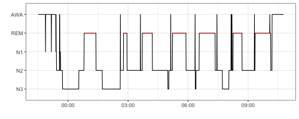
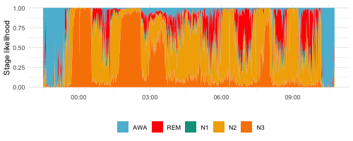

rsleep: A R package for sleep data analysis
================

<!-- README.md is generated from README.Rmd. Please edit that file -->

[](https://cran.r-project.org/package=rsleep)
[](https://cran.r-project.org/package=rsleep)
[](https://travis-ci.org/boupetch/rsleep)
[](https://codecov.io/gh/boupetch/rsleep)
[](https://opensource.org/licenses/MIT)

rsleep is a R package providing tools for sleep data management,
visualization and analysis.

## Installation

Development version (recommended) can be directly installed from
[Github](https://github.com/) using the `devtools` package :

``` r
devtools::install_github("boupetch/rsleep")
```

Stable version can be downloaded and installed from
[CRAN](https://cran.r-project.org/) \[1\] :

``` r
install.packages("rsleep", repos = "https://cloud.r-project.org")
```

## Usage

``` r
library(rsleep)
```

## Vignettes

-   [Managing Sleep Records
    Files](http://htmlpreview.github.io/?https://raw.githubusercontent.com/boupetch/rsleep/master/doc/Managing_Sleep_Records_Files.html)
-   [Spectral analysis of sleep electroencephalography
    signals](http://htmlpreview.github.io/?https://raw.githubusercontent.com/boupetch/rsleep/master/doc/Spectral_analysis_sleep_electroencephalography.html)
-   [Automatic Stages
    Classification](http://htmlpreview.github.io/?https://raw.githubusercontent.com/boupetch/rsleep/master/doc/Automatic_Stage_Classification.html)

## Examples

[](http://htmlpreview.github.io/?https://raw.githubusercontent.com/boupetch/rsleep/master/doc/Managing_Sleep_Records_Files.html)

[](http://htmlpreview.github.io/?https://raw.githubusercontent.com/boupetch/rsleep/master/doc/Automatic_Stage_Classification.html)

[](http://htmlpreview.github.io/?https://raw.githubusercontent.com/boupetch/rsleep/master/doc/Spectral_analysis_sleep_electroencephalography.html)

## References

<div id="refs" class="references csl-bib-body">

<div id="ref-hornik2012comprehensive" class="csl-entry">

<span class="csl-left-margin">\[1\] </span><span
class="csl-right-inline">K. Hornik, The comprehensive r archive network,
Wiley Interdisciplinary Reviews: Computational Statistics. 4 (2012)
394–398. <https://cran.r-project.org/>.</span>

</div>

</div>
