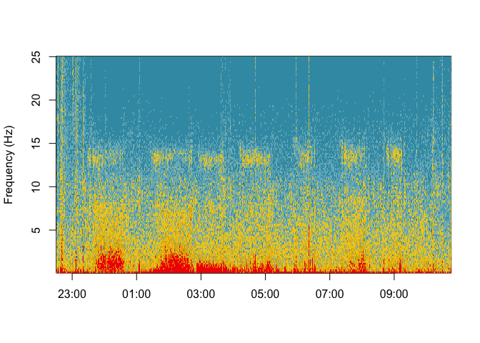

rsleep: A R package for sleep data analysis
================

<!-- README.md is generated from README.Rmd. Please edit that file -->

## Installation

`rsleep` development version can be directly installed from Github using
the `devtools` package.

    devtools::install_github("boupetch/rsleep")

Otherwise stable version can be downloaded and installed from CRAN \[1\]
:

    install.packages("rsleep")

## Getting sleep data

An example sleep record can be downloaded using the following code line.
It contains full polysomnography data recorded over a whole night.
Signals form sensors are stored in the European Data Format \[2\] (EDF)
file, while events are stored in the Comma-Separated Values (CSV) file,

``` r

download.file("http://cloud.frenchkpi.com/s/65cm6DMq7SYKQ6J/download", "15012016HD.edf")

download.file("http://cloud.frenchkpi.com/s/wreGqkitWNnWwnP/download", "15012016HD.csv")
```

## Records manipulation

In `rsleep`, `write_mdf()` and `read_mdf()` functions are used to write
and read records on disk. Files are converted from the EDF to Morpheo
Data Format \[3\] (MDF). MDF is a simple, efficient and interoperable
hierarchical file format for biological timeseries. The format supports
raw signal and metadata storage. MDF uses binary files for signals and
JSON for metadata.

``` r

if(!dir.exists("15012016HD")){
  events <- read_events_noxturnal("15012016HD.csv")

  write_mdf(edfPath = "15012016HD.edf",
            mdfPath = "15012016HD",
            channels = c("C3-M2", "ECG"),
            events = events)
}
```

``` r

events <- read_events_noxturnal("15012016HD.csv")

write_mdf(edfPath = "15012016HD.edf",
          mdfPath = "15012016HD",
          channels = c("C3-M2", "ECG"),
          events = events)
```

Once written on disk, MDF records can be read using the `read_mdf()`
function. It quickly returns signals, events and metadata as a list.

``` r

mdf <- read_mdf("15012016HD")
```

## Sleep Stages

Hypnograms \[4\] can be plotted from stages data stored in a dataframe.

``` r

plot_hypnogram(mdf$events)
```

<!-- -->

## Epoching

``` r

reference <- hypnogram(mdf$events)
reference <- reference[-nrow(reference),]

epochs <- epochs(signals = lapply(mdf$channels,function(x){x$signal}),
                 sRates = lapply(mdf$channels,function(x){x$metadata$sRate}),
                 resample = 200,
                 epoch = reference,
                 startTime = as.numeric(as.POSIXct(mdf$metadata$startTime)))
```

## Electroencephalography

Fourier transforms are computed over EEG during sleep since 1942 \[5\] .
Spectrograms of whole night signals can be plotted using the
`spectrogram` function.

``` r

spectrogram(signal = mdf$channels$`C3-M2`$signal,
            sRate = mdf$channels$`C3-M2`$metadata$sRate,
            startTime = as.POSIXct(mdf$metadata$startTime))
```

<!-- -->

### Spectral powers

``` r

bands <- lapply(epochs,function(x){
  apply(x, 2, function(y){
    bands_power(bands = list(c(0.5,3.5),c(3.5,7.5),c(7.5,13),c(13,30)),
                signal = y, sRate = 200,
                broadband = c(0.5,30))
  })
})
```

``` r

c3m2 <- lapply(bands,function(x){
  unlist(x$`C3-M2`)
})
bands_df <- data.frame(matrix(unlist(c3m2), nrow=length(c3m2), byrow=TRUE))

colnames(bands_df) <- c("Delta","Theta","Alpha","Beta")
bands_df$stage <- reference$event
bands_df <- reshape2::melt(bands_df, id="stage")

summary(bands_df)
#>  stage       variable        value         
#>  N3 :1024   Delta:1469   Min.   :0.004375  
#>  N2 :2164   Theta:1469   1st Qu.:0.006235  
#>  N1 :  36   Alpha:1469   Median :0.008367  
#>  REM:1904   Beta :1469   Mean   :0.008254  
#>  AWA: 748                3rd Qu.:0.009860  
#>                          Max.   :0.014397
```

``` r

library(ggplot2)

pal <- c("#FF0000","#00A08A","#F98400","#5BBCD6")
ggplot(bands_df,aes(x=stage,y=value,fill=variable)) + 
  geom_boxplot() + theme_bw() +
  scale_fill_manual(values = pal) +
  theme(legend.title = element_blank()) +
  xlab("") + ylab("Normalized power") 
```

<!-- -->

## Electrocardiography

`detect_rpeaks` implements the first part of the Pan & Tompkins
algorithm \[6\] to detect R peaks from an electrocardiogram (ECG)
signal.

``` r

library(ggplot2)

sRate <- 200

ecg <- data.frame(Volts = example_ecg_200hz,
                  Seconds = c(1:length(example_ecg_200hz))/sRate)

rpeaks <- detect_rpeaks(example_ecg_200hz, sRate)

ggplot(ecg,
       aes(x = Seconds,
           y = Volts)) +
  geom_line() + theme_bw() +
  geom_vline(data.frame(p = rpeaks),
             mapping = aes(xintercept = p),
             linetype="dashed",color = "red")
```

<!-- -->

## Statistics computing

### Stages & scoring

`stages_stats` function computes various statistics from the hypnogram.

  - `rem_duration`: Total duration of REM sleep in minutes.
  - `n1_duration`: Total duration of N1 sleep in minutes.
  - `n2_duration`: Total duration of N2 sleep in minutes.
  - `n3_duration`: Total duration of N3 sleep in minutes.
  - `awa_duration`: Total duration of wake in minutes.
  - `tts`: Time To Sleep (N1+N2+N3+REM durations) in minutes.
  - `rem_tts`: REM over TTS duration ratio.
  - `n3_tts`: N3 over TTS duration ratio.
  - `n2_tts`: N2 over TTS duration ratio.
  - `n1_tts`: N1 over TTS duration ratio.
  - `tsp`: Total Sleep Period.
  - `sleep_efficiency`: Sleep Efficiency.
  - `sleep_latency`: Sleep Latency.
  - `rem_latency`: REM Sleep Latency.
  - `waso`: Wake After Sleep Onset.

<!-- end list -->

``` r

stages_stats(example_hypnogram_30s)
#> rem_duration  n1_duration  n2_duration  n3_duration awa_duration 
#> 2.380000e+02 4.500000e+00 2.705000e+02 1.280000e+02 9.400000e+01 
#>          tts      rem_tts       n1_tts       n2_tts       n3_tts 
#> 6.410000e+02 3.712949e-01 7.020281e-03 4.219969e-01 1.996880e-01 
#>      awa_tts          tsp   efficiency      latency   n1_latency 
#> 1.466459e-01 7.360000e+02 8.709239e-01 2.200000e+01 0.000000e+00 
#>   n2_latency   n3_latency  rem_latency         waso 
#> 3.300000e+01 5.100000e+01 1.160000e+02 7.300000e+01
```

## References

<div id="refs" class="references">

<div id="ref-hornik2012comprehensive">

\[1\] K. Hornik, The comprehensive r archive network, Wiley
Interdisciplinary Reviews: Computational Statistics. 4 (2012) 394–398.
<https://cran.r-project.org/>.

</div>

<div id="ref-kempSimpleFormatExchange1992">

\[2\] B. Kemp, A. Värri, A.C. Rosa, K.D. Nielsen, J. Gade, A simple
format for exchange of digitized polygraphic recordings,
Electroencephalography and Clinical Neurophysiology. 82 (1992) 391–393.
doi:[10.1016/0013-4694(92)90009-7](https://doi.org/10.1016/0013-4694\(92\)90009-7).

</div>

<div id="ref-bouchequetMorpheoDataFormat2018a">

\[3\] P. Bouchequet, D. Jin, G. Solelhac, M. Chennaoui, D. Leger,
Morpheo Data Format (MDF), un nouveau format de données simple, robuste
et performant pour stocker et analyser les enregistrements de sommeil,
Médecine Du Sommeil. 15 (2018) 48–49.
doi:[10.1016/j.msom.2018.01.130](https://doi.org/10.1016/j.msom.2018.01.130).

</div>

<div id="ref-AASMScoringManual">

\[4\] AASM Scoring Manual - American Academy of Sleep Medicine, American
Academy of Sleep Medicine Association for Sleep Clinicians and
Researchers. (n.d.).
<https://aasm.org/clinical-resources/scoring-manual/>.

</div>

<div id="ref-knottFourierTransformsElectroencephalogram1942">

\[5\] J.R. Knott, F.A. Gibbs, C.E. Henry, Fourier transforms of the
electroencephalogram during sleep., Journal of Experimental Psychology.
31 (1942) 465–477.
doi:[10.1037/h0058545](https://doi.org/10.1037/h0058545).

</div>

<div id="ref-panRealTimeQRSDetection1985">

\[6\] J. Pan, W.J. Tompkins, A Real-Time QRS Detection Algorithm, IEEE
Transactions on Biomedical Engineering. BME-32 (1985) 230–236.
doi:[10.1109/TBME.1985.325532](https://doi.org/10.1109/TBME.1985.325532).

</div>

</div>
